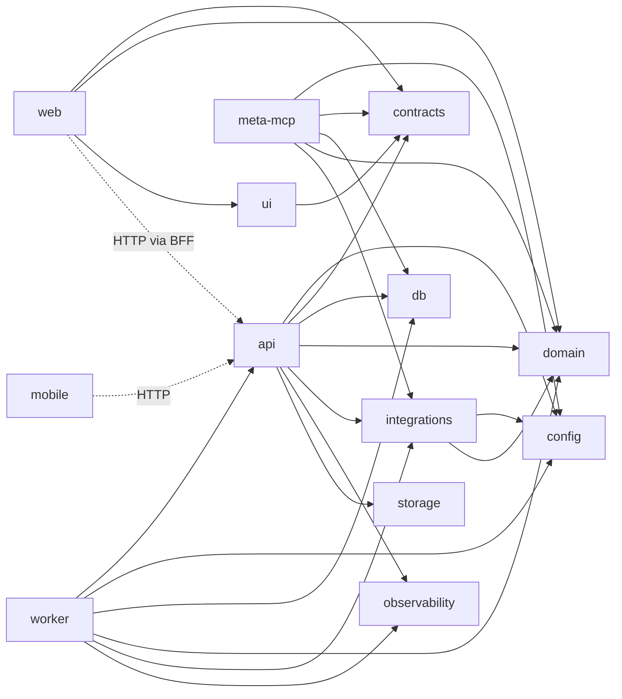

# 01 — Arquitetura atual (estado real em 2026-09-10)

> Base: commit `a6683bf` (branch `claude/aluguei-technical-audit-6cea11` = `main` local). Fonte de verdade: código, `package.json`, execução local. Documentos antigos só como evidência histórica.
> Método: inventário mecânico (`git ls-files`, extração de rotas, dependências de workspace), execução real (install congelado, gates forçados sem cache, API/worker/web rodando contra PostgreSQL 17 isolado) e 8 agentes de leitura (relatórios em `evidence/`).

## 1. Visão geral

Monorepo **pnpm 11.15.1 + turbo 2.10.9**, TypeScript strict (**TS 6.0.3**; `apps/meta-mcp` usa 5.9.2), **Node ≥ 24** (executado com v24.19.0).

| Camada          | Tecnologia (versão instalada, lockfile congelado)                         |
| --------------- | ------------------------------------------------------------------------- |
| API             | Fastify 5.12.0 + @fastify/helmet/cors/cookie/rate-limit 11.2.0            |
| ORM/DB          | drizzle-orm 0.45.2 + PostgreSQL 17 (testes de integração em PGlite 0.5.5) |
| Validação       | zod 4                                                                     |
| Web             | Next.js 16.3.0 (App Router, Turbopack) + React 19.2.3                     |
| Mobile          | Expo 57.0.12 / React Native 0.86.2                                        |
| Worker          | fila em Postgres (`FOR UPDATE SKIP LOCKED`)                               |
| MCP             | @modelcontextprotocol/sdk 1.30 (stdio)                                    |
| Testes          | vitest 4.1.10, Playwright (E2E)                                           |
| Observabilidade | pino (redact) + OpenTelemetry (sem instrumentação — ver 13)               |

Arquivos versionados: **687** (`git ls-files | wc -l`). Distribuição: `apps` 220 · `packages` 238 · `tests` 33 · `docs` 61 · `design-source` 40 · `.opencode` 43 · `orchestration` 26 · 2 zips na raiz (ver 10/P1-23).

## 2. Inventário por app/pacote

| App/pacote               | Função                                                                                                                                    | Entrypoint                                 | Dependências de workspace                                           | Consumidores                                       | Testes (executados hoje)    | Status                                                           | Dívida / bloqueadores                                                                                                                            |
| ------------------------ | ----------------------------------------------------------------------------------------------------------------------------------------- | ------------------------------------------ | ------------------------------------------------------------------- | -------------------------------------------------- | --------------------------- | ---------------------------------------------------------------- | ------------------------------------------------------------------------------------------------------------------------------------------------ |
| `apps/api`               | API HTTP — **154 endpoints** em 28 arquivos de rota, 14 plugins                                                                           | `src/index.ts` → `buildApp` (`src/app.ts`) | config, contracts, db, domain, integrations, observability, storage | web (BFF), mobile, E2E, worker (importa internals) | 5 (2 arquivos)              | Funciona; sobe em 1 s; `/health` e `/health/ready` OK            | Exporta internals por subpath (`./audit`, `./ledger`, `./channel-jobs`, `./whatsapp`) consumidos pelo worker; `REDIS_URL` derruba o boot (P1-14) |
| `apps/web`               | Painel backoffice (35 páginas `/app/**`), vitrine, portais, BFF                                                                           | Next App Router (`src/app`)                | contracts, domain, ui                                               | usuários                                           | 10 (5 arquivos)             | Renderiza as 44 páginas; fluxos de criação bloqueados (P1-01/02) | Sem `middleware.ts`; BFF genérico `/api/backend/[...path]` sem allowlist; `next start` exige API em HTTPS (P1-15)                                |
| `apps/worker`            | Filas: inbox (WhatsApp, screening, assinatura, vistoria, pagamento, scheduler, reconcile, Meta webhook), canais, intents Meta, heartbeat  | `src/index.ts` (poll)                      | **api**, config, db, domain, integrations, observability            | —                                                  | 9 (4 arquivos)              | Processa jobs; 2 instâncias sem duplicidade observada            | Acoplado a internals da API; não loga jobs; sem health; shutdown com `process.exit` imediato                                                     |
| `apps/mobile`            | App de campo (Expo): login → agenda → visita → vistoria → revisão                                                                         | `index.ts` / `App.tsx`                     | **nenhuma** (tipos copiados à mão, `src/types.ts:1-4`)              | corretores/vistoriadores                           | 5 (1 arquivo)               | MOBILE PARCIAL (ver 12)                                          | Sem câmera/fotos/áudio/offline/SecureStore/logout                                                                                                |
| `apps/meta-mcp`          | Servidor MCP stdio com **17 tools** Meta Ads (7 leitura, 10 escrita)                                                                      | `src/index.ts`                             | config, contracts, db, domain, integrations                         | agente LLM (stdio)                                 | 7 (1 arquivo)               | MOCK_VERIFIED                                                    | Acessa o banco direto (`context.ts:32`), sem autenticação; `MCP_ALLOWED_ORG_ID` opcional (P1-21)                                                 |
| `packages/config`        | Env schema zod (47 variáveis) + AES-256-GCM                                                                                               | `src/index.ts`                             | —                                                                   | api, worker, mcp, integrations                     | 4                           | OK                                                               | Nenhuma variável obrigatória em produção; `NODE_ENV` default `development` (P1-12)                                                               |
| `packages/contracts`     | Contratos zod de I/O — **306 exports `*Schema`** (278 declarados com `z.`, 22 derivados, 6 aliases)                                       | `src/index.ts`                             | —                                                                   | api, web, ui, meta-mcp, tests                      | 7                           | OK                                                               | 84/95 schemas de request/query sem `.strict()`; 96 exports sem uso fora do pacote                                                                |
| `packages/db`            | Schema drizzle (**72 tabelas**) + 11 migrations + `db:apply`                                                                              | `src/index.ts`                             | —                                                                   | api, worker, mcp, tests                            | — (coberto pela integração) | Migrations do zero OK; sem drift                                 | 0 CHECK, 0 RLS, 1 enum (ver 02)                                                                                                                  |
| `packages/domain`        | Regras puras — 29 arquivos, 88 funções exportadas, **12 máquinas de estado**                                                              | `src/index.ts`                             | —                                                                   | api, worker, web (tipos RBAC), mcp                 | 96 (13 arquivos)            | OK                                                               | Juros 1%/dia fixos (P1-07); `canPortalReadInspection` sem uso                                                                                    |
| `packages/integrations`  | Adapters + fakes + registries (payments, signature, screening, meta-ads, whatsapp, channels, geocoding, places, ai, inspection-ai, redis) | `src/index.ts`                             | config, domain                                                      | api, worker, mcp                                   | 154 (15 arquivos)           | Adapters testados com mocks de rede                              | Nenhum sandbox/live; 3 BROKEN (ver 07)                                                                                                           |
| `packages/observability` | logger pino + tracer OTEL                                                                                                                 | `src/index.ts`                             | —                                                                   | api, worker                                        | 4                           | Logger OK                                                        | Tracer sem instrumentações; só API                                                                                                               |
| `packages/storage`       | S3/R2 (presign PUT/GET, HEAD)                                                                                                             | `src/index.ts`                             | —                                                                   | api                                                | 8                           | IMPLEMENTED_NOT_VERIFIED                                         | Sem bucket → upload desabilitado em runtime                                                                                                      |
| `packages/ui`            | Componentes/tokens PEG (34 componentes + ícones)                                                                                          | `src/index.ts` + CSS                       | contracts                                                           | web                                                | 6                           | OK                                                               | 8 componentes só usados em `/dev`; foco de Modal/Drawer (ver 10)                                                                                 |
| `tests/integration`      | 93 testes em PGlite com API real (`app.inject`)                                                                                           | vitest                                     | api, config, db, domain, integrations, storage, worker              | CI                                                 | 93 (17 arquivos, 241,9 s)   | Verde                                                            | Só caminho feliz financeiro in-process                                                                                                           |
| `tests/contract`         | 10 testes de fronteira                                                                                                                    | vitest                                     | contracts, domain                                                   | CI                                                 | 10                          | Verde                                                            | Pequeno                                                                                                                                          |
| `tests/e2e`              | Playwright (3 testes) + `scripts/boot-stack.mjs`                                                                                          | `playwright test`                          | config                                                              | manual (não está no CI)                            | ver 09                      | ver 09                                                           | Boot frágil a diretório temporário remanescente                                                                                                  |

Pacotes exportam **`src/*.ts` diretamente** (`"exports": {".": "./src/index.ts"}`) — a troca para `dist/` prevista na ADR-004 não aconteceu.

## 3. Grafo de dependências (workspace)

Acoplamentos a registrar:

1. **worker → api (internals)**: `apps/worker/src/paymentJobs.ts:25-26` (`@aluguei/api/audit`, `@aluguei/api/ledger`), `inboxJobs.ts:6` (`@aluguei/api/whatsapp`), `channelJobs.ts:17`. Qualquer refactor da API quebra o worker; não há fronteira de pacote de domínio de aplicação.
2. **meta-mcp → db direto**: não passa pela API, então RBAC/rate-limit/auditoria da API não se aplicam às tools.
3. **mobile sem contratos compartilhados**: drift silencioso possível (`apps/mobile/src/types.ts:1-4`).

## 4. Topologia de runtime (como foi executada nesta auditoria)

| Processo                            | Porta | Comando                                                                                                                                                  | Observação                                                            |
| ----------------------------------- | ----- | -------------------------------------------------------------------------------------------------------------------------------------------------------- | --------------------------------------------------------------------- |
| PostgreSQL 17 (cluster descartável) | 55432 | `initdb` + `pg_ctl` no scratchpad                                                                                                                        | O serviço PG da máquina (5432) **não foi tocado**                     |
| API                                 | 4100  | `node --import tsx apps/api/src/index.ts` com `PAYMENT_PROVIDER=FAKE SIGNATURE_PROVIDER=FAKE SCREENING_PROVIDER=FAKE META_MODE=dry_run AI_PROVIDER=mock` | helmet + CSP + rate limit 300/min                                     |
| Worker ×2                           | —     | `node --import tsx apps/worker/src/index.ts`                                                                                                             | duas instâncias simultâneas                                           |
| Web (dev)                           | 3417  | `next dev -p 3417` com `API_BASE_URL`, `APP_BASE_URL`, `PUBLIC_ORG_SLUG`                                                                                 | `next start` (produção) **não funciona** contra API `http://` (P1-15) |
| Meta MCP                            | stdio | —                                                                                                                                                        | exercitado só via testes (7)                                          |

Portas 3100 e 3220 estavam ocupadas por **outro projeto** ("Máquina Nerd Next JS") de outra sessão — não foram tocadas.

## 5. Números atuais × baseline histórico

| Item                 | Baseline (docs 08/2026)         | Atual (executado/medido hoje)                                                  | Diferença                                |
| -------------------- | ------------------------------- | ------------------------------------------------------------------------------ | ---------------------------------------- |
| Tabelas              | 72                              | **72**                                                                         | =                                        |
| Migrations           | 11 (0000–0009, 0011)            | **11** (lacuna 0010 mantida)                                                   | =                                        |
| Endpoints            | 152                             | **154** (GET 67 · POST 69 · PATCH 11 · PUT 2 · DELETE 5)                       | +2 (`/places/*`, commit `52eb922`)       |
| Schemas Zod          | 278 / 267 (docs contraditórios) | **306** exports `*Schema` (278 com `z.` direto; 267 pela regex de linha única) | metodologias diferentes; nenhuma remoção |
| Módulos de domínio   | 29 / 14                         | 29 arquivos / 14 diretórios; 12 máquinas de estado                             | =                                        |
| Tools MCP            | 17                              | **17**                                                                         | =                                        |
| Rotas web            | 43                              | **44** páginas + 7 route handlers                                              | +1 (a própria matriz antiga listava 44)  |
| Testes               | ~235 (08-14) / ~250 (08-17)     | **418** (65 arquivos, 24 tarefas turbo, 0 falha, 0 skip)                       | +168                                     |
| Testes de integração | 79 → 93                         | **93**                                                                         | = ao último relatório                    |

## 6. CI (`.github/workflows/ci.yml`)

Install congelado → format → lint → typecheck → secret scan → audit prod (informativo) → **audit critical (bloqueante)** → test → `db:generate` + checagem de drift → build. **Sem E2E**. Estado hoje: vermelho em **format** (1 arquivo) e **audit critical** (2 advisories do `next`) — ver 09.
